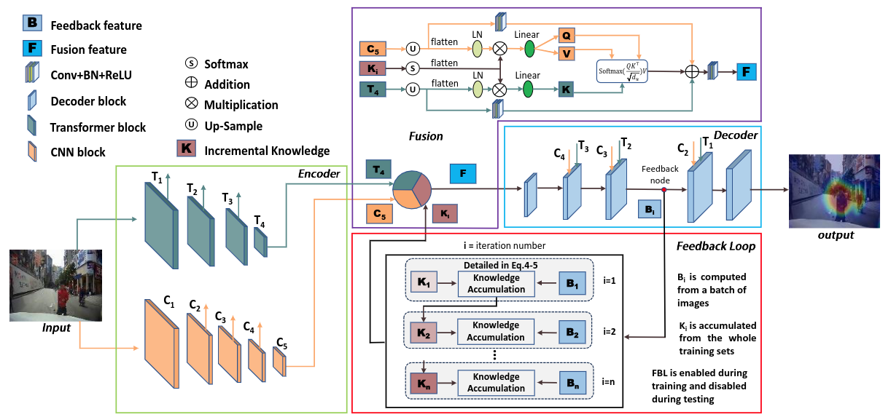
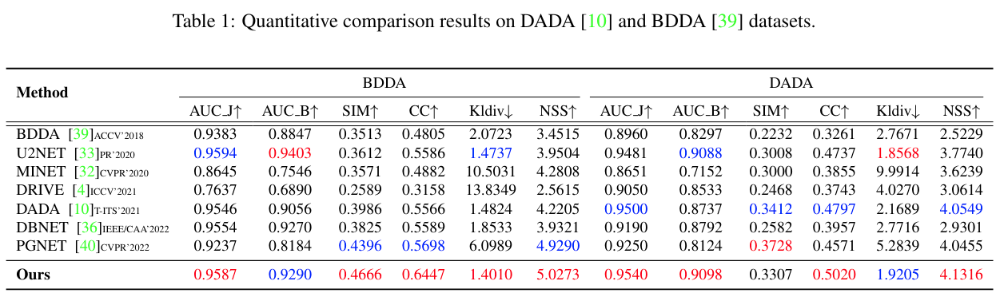

<h2 align="center"> <a href="https://arxiv.org/abs/2212.02096"> FBLNet: FeedBack Loop Network for Driver Attention Prediction</a></h2>
<h4 align="center" color="A0A0A0"> Yilong Chen, Zhixiong Nan, Tao Xiang</h4>
<h5 align="center"> If you like our project, please give us a star ⭐ on GitHub for the latest update.</h5>

<div align="center">

[](https://arxiv.org/abs/2212.02096)
[](https://github.com/CQU-ADHRI-Lab/FBLNet)
[](https://github.com/CQU-ADHRI-Lab/FBLNet/blob/main/LICENSE)


</div>


# FBLNet model

This is the official implementation of the paper "FBLNet: FeedBack Loop Network for Driver Attention Prediction".

<div align="center">
  
</div><br/>


This is the comparison results on [BDDA](https://github.com/pascalxia/driver_attention_prediction) and [DADA](https://github.com/JWFangit/LOTVS-DADA) datasets.

<div align="center">
  
</div><br/>

## Update
The code for FBLNet will be released here.

[2023/7] FBLNet has been accepted at ICCV 2023 as a poster!

## <a name="CitingFBLNet"></a>Citing FBLNet

If you find our work helpful for your research, please consider citing the following BibTeX entry.

```BibTeX
@inproceedings{chen2023fblnet,
  title={FBLNet: FeedBack Loop Network for Driver Attention Prediction},
  author={Chen, Yilong and Nan, Zhixiong and Xiang, Tao},
  booktitle={Proceedings of the IEEE/CVF International Conference on Computer Vision},
  pages={13371--13380},
  year={2023}
}
```
